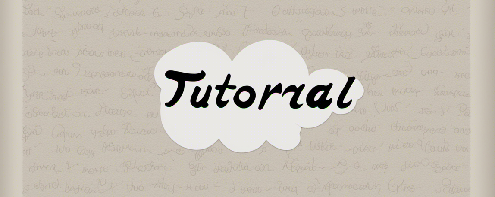

# IEEE PES Working Group "Cloud4PowerGrid" Tutorials Repo

|  | 
|:--:| 
| *Image generated by Stable Duffision open model SDXL 1.0* |

### The tutorials are oriented to power system practitioners. Personas include power system engineers, enterprise architect, data analysts, data scientists, ML engineers, business intelligence analysts.

> **Disclaimer**: the tutorials don't aim to provide any general guidance or CSP-specific best practices to address the cyber security and regulatory compliance concerns for the power industry stakeholders. Instead, it is developed to demonstrate the cloud advantages and readiness for unleashing the unseen values from power system businesses. We are **NOT** suggesting the configurations, permissions and policies shown in the demo cases for your production deployment. For detailed guidance on how to adopt cloud securely and reliably, please refer to the cloud provider's documentation and work with your IT, Cyber Security and Enterprise Architecture teams. You can also read our paper [Practical Adoption of Cloud Computing in Power Systems- Drivers, Challenges, Guidance, and Real-world Use Cases][IEEE-paper] for reference.

[IEEE-paper]: <https://arxiv.org/ftp/arxiv/papers/2108/2108.00303.pdf>

